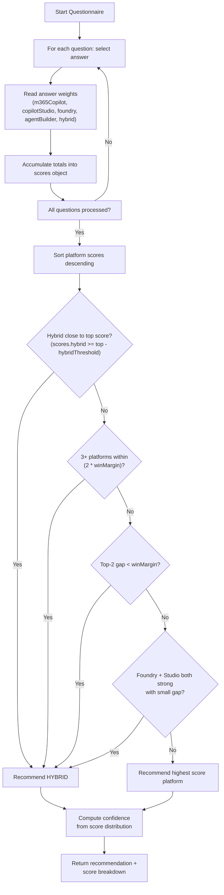

# Microsoft Agentic Solution Advisor

A production-quality web application that guides users through a structured questionnaire to determine which Microsoft agentic platform—**Microsoft 365 Copilot**, **Copilot Studio**, or **Microsoft Foundry**—fits each specific use case in their organization. Most organizations use all three platforms; this tool helps you decide which to use when.

**✅ Aligned with the [Microsoft AI Decision Framework](https://microsoft.github.io/Microsoft-AI-Decision-Framework/)** - 100% coverage of all 8 evaluation criteria.

## 🚀 Quick Links

- **[Customer Deployment Guide](./docs/CUSTOMER_DEPLOYMENT_GUIDE.md)** - Complete setup guide for customers cloning this repo
- **[Configuration Guide](./docs/CONFIGURATION_GUIDE.md)** - Detailed Azure integration and environment variable documentation
- **[Recurring Maintenance Tasks](./docs/RECURRING-MAINTENANCE.md)** - Monthly licensing validation, weekly updates, and other scheduled tasks
- **[Implementation Guide Monitoring](./docs/IMPLEMENTATION_GUIDE_MONITORING.md)** - Automated monthly monitoring of Microsoft Copilot Studio Implementation Guide updates
- **[Implementation Guide Alignment](./docs/IMPLEMENTATION_GUIDE_ALIGNMENT.md)** - Enhancement plan aligned with official Microsoft Copilot Studio guidance
- **[Monthly Licensing Validation](./docs/MONTHLY-LICENSING-VALIDATION.md)** - Automated validation of Copilot Studio licensing information
- **[Weekly Validation Process](./docs/weekly-validation-process.md)** - Automated monitoring of official Microsoft release notes
- **[Site Documentation (Playwright + Screenshots)](./docs/SITE_DOCUMENTATION_PLAYWRIGHT.md)** - Route-by-route site documentation with full-page screenshots
- **[Quick Start](#quick-start)** - Get running in 5 minutes (no configuration required)

## Copilot Operating Guides (Instructions, Agents, Skills)

This repository includes custom Copilot guidance assets to make delivery more consistent and lower-risk.

### Instructions (`.github/instructions/`)

- **`azure-appservice-deployment.instructions.md`**: App Service deployment standards (startup command, health checks, rollback discipline)
- **`monorepo-dependency-policy.instructions.md`**: safe dependency upgrade policy for workspace packages
- **`release-planner-data-contract.instructions.md`**: schema and fallback behavior for release planner integration
- **`portal-feature-delivery.instructions.md`**: feature definition quality gates (acceptance criteria, KPI mapping, rollout strategy)
- **`observability-runbook.instructions.md`**: runtime diagnostics and incident triage expectations
- **`security-secrets-guardrails.instructions.md`**: secrets handling and incident response rules

### Agents (`.github/agents/`)

- **`portal-feature-implementer.agent.md`**: implement feature slices across web/API/docs with minimal risk
- **`azure-appservice-troubleshooter.agent.md`**: diagnose startup/deployment/health issues on Azure App Service
- **`release-planner-integration.agent.md`**: maintain robust release data parsing and safe link behavior

### Skills (`.github/skills/`)

- **`portal-roadmap`**: convert strategy into phased product roadmap and sprintable stories
- **`deployment-validation`**: run post-deploy checks and produce pass/fail diagnostics
- **`value-tracking`**: define feature KPIs, baselines, telemetry, and ROI reporting

### Recommended Team Usage

1. Use **`portal-roadmap`** when planning releases and epics.
2. Use **`portal-feature-implementer`** when building scoped portal capabilities.
3. Use **`deployment-validation`** after each Azure deployment.
4. Use **`azure-appservice-troubleshooter`** for production incidents.
5. Use **`value-tracking`** to ensure each feature maps to measurable customer outcomes.

### Definition of Done (Portal Features)

Use this checklist for every feature before merge/deploy:

- [ ] **Plan complete**: Epic/story has objective, acceptance criteria, and rollout scope.
- [ ] **KPI mapped**: Primary KPI, baseline assumption, and expected impact are documented.
- [ ] **Implementation complete**: Web/API/docs changes are scoped, minimal, and aligned with standards.
- [ ] **Fallbacks covered**: Error states and graceful fallback behavior are implemented.
- [ ] **Build verified**: Affected workspace build(s) pass.
- [ ] **Deployment validated**: `/api/health` and core page checks pass post-deploy.
- [ ] **Operations ready**: Logs and runbook notes are sufficient for incident triage.
- [ ] **Security reviewed**: No secrets in code/logs and credential handling follows guardrails.

## Features

### Core Decision Engine

✅ **Guided Decision Flow** - 21-question survey covering all Microsoft AI Decision Framework evaluation criteria  
✅ **3-Platform Focus** - Per-scenario guidance for Microsoft 365 Copilot, Copilot Studio, and Microsoft Foundry  
✅ **Framework-Aligned** - Questions map to Technical Complexity, Skills, Budget, Time, Governance, Action Safety, Memory, and Scale  
✅ **Deterministic Scoring** - Transparent, test-covered recommendation engine with weighted platform scores  
✅ **Comprehensive Results** - Rationale, next steps, risks, compliance considerations, and verified Microsoft Learn sources  
✅ **AI-Powered Personalized Recommendations** - Context-aware recommendations based on survey responses and tenant metrics  
✅ **Export Functionality** - Download results as JSON, Markdown, PDF, and Executive Overview PPTX (both include a holistic CxO agentic-business overview); export use-case briefs as PDF/PPTX

### Planning & Assessment Tools

✅ **Use Case Assistant** - Interactive discovery and exploration of common Microsoft Copilot use cases with detailed implementation guidance  
✅ **Readiness Assessment** - Score identity, data, security, platform, and operating model readiness with blocker detection  
✅ **Implementation Guide** - Introductory walkthroughs for Microsoft 365 Copilot and Copilot Studio covering licensing, prerequisites, role permissions, step-by-step first-agent delivery, and downloadable PDF/Markdown checklists
✅ **Interactive Mind Maps** - Copilot Studio, Microsoft 365 Copilot, and Microsoft Foundry topic maps with click-to-expand drill-down from top-level domains to sub-topics
✅ **Executive Overview Infographics** - Dedicated executive briefing page for ecosystem relationship diagrams with concise strategic context per visual
✅ **Deployment Roadmap Generator** - Create phased implementation roadmaps across all three platforms (integrated in Use Case Assistant)

### Release Tracking & News

✅ **Copilot Studio Release Dates** - Track upcoming Public Preview and GA dates from Power Platform Release Planner API  
✅ **Microsoft Foundry News** - Curated feed of Azure AI Foundry updates, announcements, and documentation changes

### Quality & Maintenance

✅ **Verified Knowledge** - All guidance based on official Microsoft Learn documentation and AI Decision Framework  
✅ **Automated Content Validation** - Weekly product-update + mind map validation, plus monthly licensing validation  
✅ **Implementation Guide Monitoring** - Automated monthly checks for updates to the Microsoft Copilot Studio Implementation Guide with in-app notifications  
✅ **Self-Hostable** - Customer-cloneable solution with optional Azure integrations

### Update Automation Schedules

- **Weekly (Monday 9 AM UTC):** `.github/workflows/validate-microsoft-updates.yml`
  - Validates product updates (`scripts/validate-microsoft-updates.ts`)
  - Validates mind map integrity + M365 link policy (`scripts/validate-mindmaps.ts`)
  - Produces `validation-report.md` + `validation-results.json`, creates issue/PR when changes are detected
- **Monthly (1st day, 9 AM UTC):** `.github/workflows/validate-licensing-monthly.yml`
  - Validates licensing and survey alignment (`scripts/validate-licensing-guide.ts`, `scripts/validate-survey-questions.ts`)
- **Monthly (implementation guide monitor):** checks Copilot Studio implementation guide updates and surfaces notifications in-app

### Validation Sources

- Microsoft 365 Copilot release notes: https://learn.microsoft.com/en-us/copilot/microsoft-365/release-notes
- Copilot Studio What's New: https://learn.microsoft.com/en-us/microsoft-copilot-studio/whats-new
- Azure AI Foundry docs: https://learn.microsoft.com/en-us/azure/ai-studio/what-is-ai-studio
- Microsoft 365 Roadmap (Copilot filter): https://www.microsoft.com/en-us/microsoft-365/roadmap?filters=Microsoft%20Copilot
- Power Platform release plan: https://learn.microsoft.com/en-us/power-platform/release-plan/
- Power Platform pricing: https://www.microsoft.com/en-us/power-platform/products/power-apps/pricing
- Microsoft Learn Copilot Studio fundamentals: https://learn.microsoft.com/en-us/microsoft-copilot-studio/fundamentals-whats-new
- Copilot and Agents Spotlight training: https://adoption.microsoft.com/en-us/customer-hub/copilot-and-agents-spotlight/

## Scoring Logic Diagram

The recommendation engine is deterministic. Each selected answer contributes platform weights, then recommendation rules evaluate score distribution and hybrid thresholds.



For an interactive web view of this diagram, open `/scoring-weights-diagram.html` in the app.

## Tech Stack

### Frontend

- **Vite** + **React 18** + **TypeScript**
- **Tailwind CSS** for styling
- **React Router** for navigation
- **React Hook Form** for form management
- **Zod** for schema validation
- **Zustand** for state management

### Backend

- **Node.js 24+** + **TypeScript** + **Express**
- RESTful API endpoints
- AI/LLM abstraction layer (Azure OpenAI or OpenAI-compatible)

### Monorepo Structure

```
copilot-decision-guidance/
├── apps/
│   ├── web/          # Vite + React frontend
│   └── api/          # Node + Express backend
├── packages/
│   └── decision-engine/  # Shared scoring logic + tests
└── docs/             # Documentation
```

## Prerequisites

- **Node.js** 24.0.0 or higher (LTS recommended)
- **npm** 10.0.0 or higher

## Quick Start

### 1. Install Dependencies

```powershell
npm install
```

This will install dependencies for all workspaces (apps/web, apps/api, packages/decision-engine).

### 2. Configure Environment Variables

Create a `.env` file in the **root** directory. All features are **optional** - the tool works in demo mode without any configuration.

```bash
# ============================================
# Core AI Features (Optional)
# ============================================

# Option 2: OpenAI-compatible (OpenAI, GitHub Models)
OPENAI_API_KEY=your_openai_or_github_key
OPENAI_ENDPOINT=https://models.github.ai
OPENAI_MODEL=openai/gpt-4.1

# Enable AI recommendations (default: false when no API keys provided)
ENABLE_AI_RECOMMENDATIONS=true

# ============================================
# Optional: Enterprise Dashboard Features
# ============================================

# Optional: Azure Authentication (for future enterprise features)
# AZURE_TENANT_ID=your-tenant-id
# AZURE_CLIENT_ID=your-client-id
# AZURE_CLIENT_SECRET=your-client-secret
# AZURE_SUBSCRIPTION_ID=your-subscription-id

# ============================================
# Server Configuration
# ============================================

# API Server Port (optional, defaults to 3001)
PORT=3001

# Node environment
NODE_ENV=development
```

**Configuration Modes:**

1. **Demo Mode** (No configuration): Tool works with sample data, shows questionnaire and deterministic recommendations
2. **AI Mode** (OpenAI keys only): Adds AI-enhanced explanations and personalized recommendations
3. **Enterprise Mode** (Azure credentials + OpenAI): Full dashboard with tenant metrics + AI recommendations

**Note:** The `.env` and `.env.local` files are the **ONLY files you may edit manually**. All other work must be done via this agent.

### 3. Run in Development Mode

```powershell
npm run dev
```

This starts:

- Frontend dev server on `http://localhost:3000`
- Backend API server on `http://localhost:3001`

If you prefer to start the frontend only after the API health check succeeds, use:

```powershell
npm run dev:gated
```

### 4. Open the Application

Navigate to [http://localhost:3000](http://localhost:3000) in your browser.

## Application Pages

The application includes the following pages:

### Main User Journey

- **Home** - [http://localhost:3000](http://localhost:3000) - Landing page with overview
- **Wizard** - [http://localhost:3000/wizard](http://localhost:3000/wizard) - Interactive questionnaire
- **Results** - [http://localhost:3000/results](http://localhost:3000/results) - Platform recommendations with AI insights

### Planning & Discovery

- **Use Case Assistant** - [http://localhost:3000/use-cases](http://localhost:3000/use-cases) - Explore common Copilot use cases with implementation guidance
- **Readiness Assessment** - [http://localhost:3000/readiness](http://localhost:3000/readiness) - Assess deployment blockers and readiness scores
- **Implementation Guide** - [http://localhost:3000/implementation-guide](http://localhost:3000/implementation-guide) - Guided setup walkthroughs for Microsoft 365 Copilot and Copilot Studio
- **Executive Overview** - [http://localhost:3000/executive-overview](http://localhost:3000/executive-overview) - Executive-focused infographic briefings on platform relationships and strategy

Executive overview infographic content is managed through `apps/web/public/executive-overview-infographics.json`.

### Release Intelligence

- **Copilot Studio Release Dates** - [http://localhost:3000/copilot-studio-release-dates](http://localhost:3000/copilot-studio-release-dates) - Track upcoming Public Preview and GA dates
- **Microsoft Foundry News** - [http://localhost:3000/foundry-news](http://localhost:3000/foundry-news) - Latest Azure AI Foundry updates and announcements

### Admin & Configuration

- **Admin Panel** - [http://localhost:3000/admin](http://localhost:3000/admin) - Local configuration (development mode only, requires `__ENABLE_ADMIN__` flag)

## Build for Production

### Build All Workspaces

```powershell
npm run build
```

This compiles:

- Frontend to `apps/web/dist/`
- Backend to `apps/api/dist/`
- Decision engine package

### Run Tests

```powershell
npm test
```

Runs Vitest tests for the decision engine scoring logic.

## How It Works

### Decision Model

The questionnaire and scoring logic are defined in:

```
packages/decision-engine/src/data/decision-model.v1.json
```

**Structure:**

- **Question Groups** (7 groups covering outcome, audience, data, integration, governance, time-to-value, cost)
- **Questions** with multiple-choice answers
- **Weights** for each answer (m365Copilot, copilotStudio, hybrid)
- **Thresholds** for determining final recommendation

### Scoring Algorithm

1. User answers questions
2. Each answer contributes weighted points to three categories
3. Totals are compared with thresholds
4. Recommendation is determined:
   - **M365 Copilot**: Productivity focus, M365 data, immediate value
   - **Copilot Studio**: Custom agents, line-of-business integration, workflows
   - **Hybrid**: Mixed signals, both broad and custom needs

### AI Integration (Optional)

When API keys are configured:

- LLM **ONLY** rewrites explanations for clarity
- LLM **NEVER** changes the recommendation or decision logic

**Microsoft Learn MCP Integration (v1.2.0+)**:

- Microsoft documentation lookup is handled through **MCP tools in the agent layer**
- Use Microsoft Learn MCP tools for a two-step flow:
  - search with `microsoft_docs_search`
  - fetch full pages with `microsoft_docs_fetch` when deeper context is needed
- Keep API recommendation logic deterministic and independent from remote MCP availability
- If MCP tools are unavailable, recommendations still use static framework knowledge plus deterministic scoring
- Falls back to deterministic templates if AI unavailable

## API Endpoints

### Core Endpoints

#### `GET /api/health`

Health check endpoint with feature status

**Returns:**

```json
{
  "status": "ok",
  "aiEnabled": true,
  "microsoftLearnIntegration": "active",
  "dashboardFeaturesEnabled": true
}
```

#### `GET /api/model`

Returns the decision model (questions and weights)

#### `POST /api/score`

**Body:** `{ "answers": { "questionId": "answerId", ... } }`  
**Returns:** `{ "recommendation": {...}, "scoringResult": {...} }`

#### `POST /api/explain`

**Body:** `{ "recommendation": {...}, "userContext": {...} }`  
**Returns:** AI-enhanced explanation (or deterministic fallback)

#### `GET /api/sources`

Returns curated Microsoft Learn source URLs

---

### Enterprise Dashboard Endpoints

#### `GET /api/metrics`

Fetches tenant metrics (costs, licenses, Power Platform, Secure Score)

**Returns:**

```json
{
  "configured": true,
  "costs": { ... },
  "licenses": { ... },
  "powerPlatform": { ... },
  "secureScore": { ... },
  "readinessScore": { ... }
}
```

**Demo Mode:** Returns sample data when Azure credentials not configured

#### `GET /api/metrics/config`

Returns dashboard configuration status

**Returns:**

```json
{
  "configured": true,
  "features": {
    "costReports": true,
    "powerPlatform": true,
    "licenses": true,
    "secureScore": true
  }
}
```

---

### AI Recommendation Endpoints

#### `POST /api/recommendation/ai`

Generates AI-powered personalized recommendation based on survey responses and optional tenant metrics

**Body:**

```json
{
  "surveyResponses": { ... },
  "scoringResult": { ... },
  "includeMetrics": true
}
```

**Returns:**

```json
{
  "recommendation": {
    "summary": "...",
    "detailedAnalysis": "...",
    "strategicGuidance": "...",
    "implementationRoadmap": ["step1", "step2", ...],
    "riskMitigation": "...",
    "costConsiderations": "...",
    "timelineEstimate": "...",
    "nextSteps": "...",
    "personalizationFactors": ["factor1", "factor2", ...]
  }
}
```

**Requires:** OpenAI or Azure OpenAI credentials in `.env`

---

## Configuration Guide

For detailed setup instructions for Azure integration and all configuration options, see:

📘 **[Configuration Guide](./docs/CONFIGURATION_GUIDE.md)**

Topics covered:

- Configuration modes (Demo, AI, Enterprise)
- Azure service principal setup
- API permissions and role assignments
- Environment variables reference
- Testing and troubleshooting

## Project Structure

```
apps/web/
├── src/
│   ├── pages/         # React pages (Landing, Wizard, Results, Admin)
│   ├── components/    # Reusable components (Layout)
│   ├── store/         # Zustand state management
│   ├── lib/           # API client, export utilities
│   ├── App.tsx        # Router setup
│   └── main.tsx       # Entry point

apps/api/
└── src/
    └── index.ts       # Express server with endpoints

packages/decision-engine/
├── src/
│   ├── types.ts       # Zod schemas and TypeScript types
│   ├── scoring.ts     # Deterministic scoring logic
│   ├── recommendations.ts  # Recommendation content generation
│   ├── data/
│   │   └── decision-model.v1.json  # Question model
│   └── index.ts       # Public API
└── src/scoring.test.ts  # Vitest tests
```

## Modifying Questions or Weights

To add or edit questions:

1. Edit `packages/decision-engine/src/data/decision-model.v1.json`
2. Follow the existing schema (see `types.ts` for Zod validation)
3. Adjust weights to influence scoring
4. Restart the dev server

**Example Question:**

```json
{
  "id": "my_new_question",
  "title": "What is your primary goal?",
  "helperText": "Select the option that best describes your needs",
  "answers": [
    {
      "id": "answer_1",
      "label": "Enhance productivity",
      "weights": { "m365Copilot": 10, "copilotStudio": 2, "hybrid": 5 }
    }
  ]
}
```

## Thresholds

Located in `decision-model.v1.json`:

```json
{
  "thresholds": {
    "winMargin": 15,
    "hybridThreshold": 10
  }
}
```

- **winMargin**: Minimum score difference for a clear winner
- **hybridThreshold**: How close hybrid score must be to top score

## Knowledge Sources

All product information is verified using **Microsoft Learn MCP Server** and documented in:

```
docs/verified-notes.md
```

Each recommendation includes links to official Microsoft Learn pages.

## Admin Panel

Access at [http://localhost:3000/admin](http://localhost:3000/admin)

Features:

- View decision model version
- Check API connection status
- Clear local storage
- View environment configuration

**⚠️ Local use only** - Not intended for production without authentication/authorization.

## Deployment Options

### Option 1: Static Frontend + Serverless Backend

- Deploy frontend to **Azure Static Web Apps**, **Vercel**, or **Netlify**
- Deploy backend API to **Azure Functions** or **AWS Lambda**

### Option 2: Container Deployment

- Build Docker images for frontend and backend
- Deploy to **Azure Container Apps**, **AWS ECS**, or **Kubernetes**

### Option 3: Full-Stack Platform (Recommended for Azure)

- Deploy to **Azure App Service** with Node.js runtime
- Serve frontend build from backend Express server

#### Azure App Service Deployment

**⚠️ IMPORTANT: If you get "Cannot find module" errors, see [AZURE_DEPLOYMENT_TROUBLESHOOTING.md](./AZURE_DEPLOYMENT_TROUBLESHOOTING.md)**

**Prerequisites:**

- Azure subscription
- VS Code with Azure App Service extension installed
- Git repository initialized
- Application built (`npm run build`)

**Deployment Steps:**

1. **Initialize Git (if not done):**

   ```powershell
   git init
   git add .
   git commit -m "Initial commit"
   ```

2. **Build the application:**

   ```powershell
   npm run build
   ```

3. **Configure Azure App Service Settings (CRITICAL):**
   - In Azure Portal → Your App Service → Configuration
   - **General Settings** → **Startup Command:**
     ```
     node server-production.js
     ```
   - **Application Settings** → Add:
     ```
     SCM_DO_BUILD_DURING_DEPLOYMENT = true
     WEBSITE_NODE_DEFAULT_VERSION = 20-lts
     ```
   - Click **Save**, then **Restart** the app

   > **Note**: No special flags needed - pure JavaScript runtime!
   > No tsx, no NPM_CONFIG_PRODUCTION=false - everything just works!

4. **Deploy via VS Code:**
   - Open Azure extension (Azure icon in sidebar)
   - Sign in to Azure
   - Right-click "App Services" → "Create New Web App (Advanced)"
   - Choose: Node 20+ LTS, Linux, Basic (B1) or higher
   - After creation, right-click the web app → "Deploy to Web App"
   - Select this workspace folder

5. **Configure Environment Variables (Optional - for AI features):**
   - In Azure Portal → Configuration → Application settings
   - Add:
     ```
     AZURE_OPENAI_API_KEY=your-key
     AZURE_OPENAI_ENDPOINT=your-endpoint
     AZURE_OPENAI_DEPLOYMENT=your-deployment
     OPENAI_API_KEY=your-openai-or-github-key
     OPENAI_ENDPOINT=https://models.github.ai
     OPENAI_MODEL=openai/gpt-4.1
     ENABLE_AI_EXPLANATIONS=true
     NODE_ENV=production
     ```

6. **Verify Deployment:**
   - Navigate to your App Service URL
   - Check `/api/health` endpoint: `https://<your-app>.azurewebsites.net/api/health`
   - Test the questionnaire flow

**Troubleshooting:**
If deployment fails with "Cannot find module" error:

1. See [AZURE_DEPLOYMENT_TROUBLESHOOTING.md](./AZURE_DEPLOYMENT_TROUBLESHOOTING.md) for detailed steps
2. Verify Startup Command is set to: `node --import tsx server-production.js`
3. Check Deployment Center logs in Azure Portal
4. Clear Azure cache and redeploy if needed

**Files for Azure Deployment:**

- `server-production.js` - Production server with integrated API
- `package.json` - With "main": "server-production.js"
- `.deployment` - Azure deployment config with custom build script
- `.azure/deploy.sh` - Custom deployment script
- `web.config` - IIS configuration (for Windows App Service)
- `apps/web/dist/` - Built frontend (committed or built during deployment)

**Default Ports:**

- Azure automatically assigns the PORT environment variable
- Local development uses PORT from `.env` (default: 3001)

## Security Considerations

1. **Never commit API keys** - Use environment variables
2. **Validate all inputs** - Zod schemas enforce type safety
3. **Secrets management** - Use Azure Key Vault, AWS Secrets Manager, etc. in production
4. **Authentication** - Add auth middleware for admin routes in production
5. **CORS** - Configure CORS properly for production domains

## Automated Documentation Updates

This repository includes **automated validation systems** that monitor official Microsoft sources to ensure the repository, survey questions, and documentation remain accurate and up-to-date.

### � Workflow Architecture

```mermaid
graph TB
    subgraph "Monthly Validation (1st of Month @ 9 AM UTC)"
        M1[Schedule Trigger<br/>cron: 0 9 1 * *] --> M2[Run Licensing<br/>Validation]
        M2 --> M3[Download Licensing<br/>Guide Metadata]
        M3 --> M4[Check Appendix<br/>Changes]
        M4 --> M5[Validate Pricing<br/>& Entitlements]

        M1 --> M6[Run Survey<br/>Validation]
        M6 --> M7[Fetch 5 Microsoft<br/>Sources]
        M7 --> M8[Parse Enablement<br/>Resources]
        M8 --> M9[Validate Questions<br/>& Answers]

        M5 --> M10{Changes<br/>Detected?}
        M9 --> M10

        M10 -->|Yes| M11[Create GitHub Issue<br/>Combined Report]
        M10 -->|Yes| M12[Upload Artifacts<br/>365-day retention]
        M10 -->|Yes| M13[Commit Check Data<br/>.github/data/]
        M10 -->|Yes| M14[Send Slack<br/>Notification]
        M10 -->|No| M15[Post Summary<br/>All Current]

        M11 --> M16[Manual Review<br/>Required]
        M16 --> M17[Update Repository<br/>Files]
        M17 --> M18[Close Issue]
    end

    subgraph "Weekly Validation (Mondays @ 9 AM UTC)"
        W1[Schedule Trigger<br/>cron: 0 9 * * 1] --> W2[Run Updates<br/>Validation]
        W2 --> W3[Check M365 Copilot<br/>Documentation Hub]
        W2 --> W4[Check Enablement<br/>Resources]
        W2 --> W5[Check Release<br/>Notes]
        W2 --> W6[Check Copilot Studio<br/>What's New]
        W2 --> W7[Check Azure AI<br/>Foundry]
        W2 --> W8[Check Roadmap &<br/>Pricing]

        W3 --> W9[Parse for Changes]
        W4 --> W9
        W5 --> W9
        W6 --> W9
        W7 --> W9
        W8 --> W9

        W9 --> W10{Changes<br/>Detected?}

        W10 -->|Yes| W11[Create GitHub Issue<br/>With Report]
        W10 -->|Yes| W12[Upload Artifacts<br/>90-day retention]
        W10 -->|Yes| W13[Send Email via<br/>Power Automate]
        W10 -->|No| W14[Post Summary<br/>No Changes]

        W11 --> W15[Manual Review<br/>& Updates]
        W15 --> W16[Close Issue]
    end

    subgraph "Primary Sources"
        S1["📄 Power Platform<br/>Licensing Guide (PDF)"]
        S2["📚 M365 Copilot<br/>Documentation Hub"]
        S3["🎓 M365 Copilot<br/>Enablement Resources"]
        S4["📋 Release Notes &<br/>What's New"]
        S5["☁️ Azure AI Foundry<br/>& Pricing"]
    end

    subgraph "Outputs & Artifacts"
        O1["📋 GitHub Issues<br/>(Combined Reports)"]
        O2["📦 Workflow Artifacts<br/>(JSON + Markdown)"]
        O3["💾 Check Data<br/>(.github/data/)"]
        O4["💬 Notifications<br/>(Slack/Email)"]
    end

    M11 -.-> O1
    W11 -.-> O1
    M12 -.-> O2
    W12 -.-> O2
    M13 -.-> O3
    M14 -.-> O4
    W13 -.-> O4

    S1 -.-> M3
    S2 -.-> M7
    S2 -.-> W3
    S3 -.-> M7
    S3 -.-> W4
    S4 -.-> M7
    S4 -.-> W5
    S4 -.-> W6
    S5 -.-> W7

    classDef monthly fill:#e1f5ff,stroke:#01579b,stroke-width:2px
    classDef weekly fill:#fff3e0,stroke:#e65100,stroke-width:2px
    classDef sources fill:#f3e5f5,stroke:#4a148c,stroke-width:2px
    classDef outputs fill:#e8f5e9,stroke:#1b5e20,stroke-width:2px
    classDef decision fill:#fff9c4,stroke:#f57f17,stroke-width:3px

    class M1,M2,M3,M4,M5,M6,M7,M8,M9,M11,M12,M13,M14,M15,M16,M17,M18 monthly
    class W1,W2,W3,W4,W5,W6,W7,W8,W9,W11,W12,W13,W14,W15,W16 weekly
    class S1,S2,S3,S4,S5 sources
    class O1,O2,O3,O4 outputs
    class M10,W10 decision
```



**Key Points:**

- 🗓️ **Monthly**: Focuses on licensing accuracy and survey question validation
- 📅 **Weekly**: Tracks feature updates and product changes
- 📦 **Artifacts**: Monthly reports kept 1 year, weekly kept 90 days
- 🔔 **Notifications**: Automatic issue creation + optional Slack/email
- 👤 **Manual Steps**: PDF verification and repository updates require human review

---

### �🗓️ Monthly: Licensing & Survey Question Validation

Every **1st of the month at 9 AM UTC**, a GitHub Action automatically runs **two comprehensive validations**:

#### 1. Licensing Guide Validation

✅ **Validates Copilot Studio licensing information:**

- Downloads latest [Power Platform Licensing Guide](https://go.microsoft.com/fwlink/?linkid=2320995)
- Checks Appendix for pricing and entitlement changes
- Validates 100% accuracy of licensing topics in repository
- Compares with previous month's snapshot

🔍 **Checks for updates to:**

- Microsoft 365 Copilot pricing ($30/user/month)
- Copilot Studio pricing ($0.01/message or $200/25k messages/month)
- Premium connector entitlements
- AI Builder capacity allocations
- Feature availability and usage limits

#### 2. Survey Question Validation

✅ **Validates survey questions against primary Microsoft sources:**

- [Microsoft 365 Copilot Documentation Hub](https://learn.microsoft.com/en-us/copilot/microsoft-365/) (Primary Source)
- [M365 Copilot Enablement Resources](https://learn.microsoft.com/en-us/copilot/microsoft-365/microsoft-365-copilot-enablement-resources) (Primary Source)
- [M365 Copilot Release Notes](https://learn.microsoft.com/en-us/copilot/microsoft-365/release-notes)
- [Copilot Studio What's New](https://learn.microsoft.com/en-us/microsoft-copilot-studio/whats-new)
- [Azure AI Foundry](https://learn.microsoft.com/en-us/azure/ai-studio/what-is-ai-studio)

🔍 **Validates question accuracy:**

- Question relevance against current Microsoft guidance
- Answer options comprehensiveness
- Alignment with M365 Copilot capabilities
- Integration patterns and architectures
- Deployment guidance and best practices
- Role-specific recommendations
- Success metrics and measurement approaches

📧 **Creates combined GitHub issue** when ANY changes detected:

- Detailed findings from both validations
- Files requiring updates
- Manual verification steps (PDF requires human review)
- Direct links to licensing guide and M365 Copilot docs

**Run manually:**

```bash
# Run licensing validation
npm run validate:licensing

# Run survey question validation
npm run validate:survey

# Run both
npm run validate:licensing && npm run validate:survey
```

**Documentation:** [Monthly Licensing & Survey Validation Guide](docs/MONTHLY-LICENSING-VALIDATION.md)

---

### � Implementation Guide Monitoring

Every **1st of the month at 3 AM UTC**, an Azure Function automatically monitors the [Microsoft Copilot Studio Implementation Guide](https://aka.ms/CopilotStudioImplementationGuide) for updates:

✅ **Automated Update Detection:**

- Checks GitHub repository for file changes
- Compares SHA hash with previously stored version
- Downloads and extracts PPTX content when updated
- Identifies chapters, topics, and slide count
- Stores version metadata in Azure Blob Storage
- Creates in-app notification banner for users

🔍 **Content Extraction:**

- Parses PowerPoint slides as XML
- Extracts chapter headings (12 chapters in v2.2)
- Identifies key topics and terminology
- Tracks version history and change frequency

📱 **User Notifications:**

- Displays prominent banner when updates detected
- Shows version number and detection date
- Lists extracted chapters and topics
- Links to official guide and alignment documentation
- "Mark as Reviewed" acknowledgment workflow

🎯 **Enhancement Integration:**

- Informs questionnaire updates
- Guides readiness assessment improvements
- Aligns with Success by Design framework
- Maps to 12 implementation areas:
  - Overview
  - Architecture
  - Language & orchestration
  - AI capabilities
  - Integrations
  - Channels, clients, and handoff
  - Security, monitoring & governance
  - Application lifecycle management (ALM)
  - Analytics & KPIs
  - Licensing and capacity
  - Testing agents
  - Dynamics 365 Omnichannel

**Documentation:**

- [Implementation Guide Monitoring System](docs/IMPLEMENTATION_GUIDE_MONITORING.md)
- [Implementation Guide Alignment Plan](docs/IMPLEMENTATION_GUIDE_ALIGNMENT.md)

**Implementation Guide Source:**

- GitHub: [microsoft/CopilotStudioSamples](https://github.com/microsoft/CopilotStudioSamples/tree/main/ImplementationGuide)
- Direct Download: [aka.ms/CopilotStudioImplementationGuide](https://aka.ms/CopilotStudioImplementationGuide)
- Current Version: **v2.2** (February 2, 2026)

---

### �📅 Weekly: Product Updates Validation

Every **Monday at 9 AM UTC**, a GitHub Action automatically:

1. ✅ **Checks official Microsoft sources for updates:**
   - [Microsoft 365 Copilot Documentation Hub](https://learn.microsoft.com/en-us/copilot/microsoft-365/) (Primary Source)
   - [M365 Copilot Enablement Resources](https://learn.microsoft.com/en-us/copilot/microsoft-365/microsoft-365-copilot-enablement-resources) (Primary Source)
   - [Microsoft 365 Copilot Release Notes](https://learn.microsoft.com/en-us/copilot/microsoft-365/release-notes) (Official)
   - [Copilot Studio What's New](https://learn.microsoft.com/en-us/microsoft-copilot-studio/whats-new) (Official)

- [Copilot and Agents Spotlight (Training)](https://adoption.microsoft.com/en-us/customer-hub/copilot-and-agents-spotlight/) (Official Training)
- [Azure AI Foundry Documentation](https://learn.microsoft.com/en-us/azure/ai-studio/what-is-ai-studio)
- Microsoft 365 Roadmap (Copilot filter)
- Power Platform Release Planner
- Microsoft Learn documentation
- Pricing pages

2. 🔍 **Validates repository accuracy:**
   - Licensing information and pricing
   - Product features and capabilities
   - Survey questions alignment with current features
   - Documentation currency

3. 📧 **Sends notifications** when changes are detected
4. 📋 **Creates GitHub issues** with detailed change reports
5. 📝 **Creates draft PRs** for review and approval
6. ⏰ **Awaits manual review** before applying updates

### 🚀 Quick Setup

1. **Install dependencies:**

   ```bash
   npm install
   ```

2. **Test validation locally:**

   ```bash
   # Monthly validations
   npm run validate:licensing
   npm run validate:survey

   # Weekly validation
   npm run validate
   ```

3. **Setup notifications (optional):**
   - See [Weekly Validation Process Guide](docs/weekly-validation-process.md)
   - Configure Power Automate or Azure Logic Apps for email alerts
   - Add webhook URL to GitHub Secrets as `POWER_AUTOMATE_WEBHOOK_URL` or `LOGIC_APP_WEBHOOK_URL`

4. **First run:**
   ```bash
   # Manual trigger via GitHub Actions UI
   # Or use GitHub CLI
   gh workflow run validate-licensing-monthly.yml -f force_notification=true
   gh workflow run validate-microsoft-updates.yml -f force_notification=true
   ```

### 📚 Documentation

- **[Recurring Maintenance Tasks](docs/RECURRING-MAINTENANCE.md)** - Complete overview of all automated and manual maintenance tasks
- **[Monthly Licensing Validation](docs/MONTHLY-LICENSING-VALIDATION.md)** - Detailed guide for Copilot Studio licensing validation
- **[Weekly Validation Process](docs/weekly-validation-process.md)** - Complete guide with setup instructions, source monitoring, and troubleshooting

### 🔧 Commands

```bash
# Run monthly licensing validation
npm run validate:licensing

# Run weekly product updates validation
npm run validate

# Watch mode for development
npm run validate:watch

# Trigger GitHub Actions (requires gh CLI)
gh workflow run validate-licensing-monthly.yml    # Monthly licensing
gh workflow run validate-microsoft-updates.yml    # Weekly updates
```

### 📊 Monitoring

The workflows run automatically:

- **Monthly** (1st of month at 9 AM UTC): Licensing guide + survey question validation
- **Weekly** (Mondays at 9 AM UTC): Product updates validation

You can:

- View runs in the **Actions** tab
- Check validation reports in artifacts:
  - **Monthly validations:** Kept for 365 days (1 year)
  - **Weekly validations:** Kept for 90 days
- Review GitHub issues for detected changes
- Approve updates via Power Automate (optional)

See [Recurring Maintenance Tasks](docs/RECURRING-MAINTENANCE.md) for a complete overview of all scheduled tasks.

## Contributing

This tool is built to be extended:

- Add new question groups in `decision-model.v1.json`
- Extend recommendation logic in `recommendations.ts`
- Add new export formats in `export.ts`
- Enhance UI components in `apps/web/src/components/`

## Troubleshooting

### Port Already in Use

Change the port in `.env`:

```bash
PORT=3002
```

### Module Not Found

Reinstall dependencies:

```powershell
npm install
```

### Tests Failing

Run tests with verbose output:

```powershell
npm test -- --reporter=verbose
```

## License

This tool is provided as-is for informational purposes. It is **not official Microsoft guidance**.

## Support

For questions or issues:

- Review [docs/decision-model.md](docs/decision-model.md) for methodology
- Check [docs/verified-notes.md](docs/verified-notes.md) for source references
- Refer to official Microsoft Learn documentation for product details

---

**Built with verified guidance from [Microsoft Learn](https://learn.microsoft.com)**
