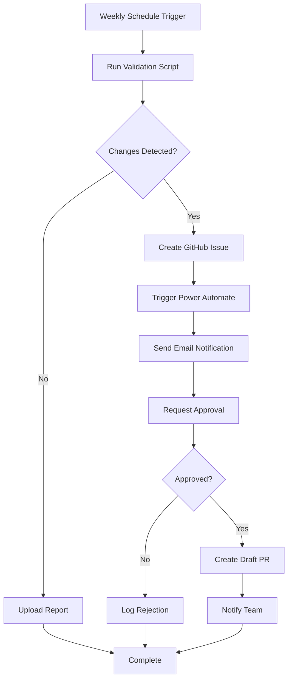

# Automated Microsoft Product Updates Validation

This system automatically monitors Microsoft sources for updates to Copilot products and notifies you of changes requiring documentation updates.

## 📋 Overview

The automation consists of three main components:

1. **Validation Script** - Checks Microsoft sources for updates
2. **GitHub Actions Workflow** - Runs weekly and orchestrates the process
3. **Notification System** - Sends email alerts via Power Automate or Azure Logic Apps

## 🎯 What It Does

Every week (Monday at 9 AM UTC), the system:

1. ✅ Checks official Microsoft sources:
   - Microsoft 365 Roadmap
   - Power Platform Release Planner
   - Microsoft Learn documentation
   - Power Platform pricing pages
   - Microsoft 365 Copilot documentation

2. 🔍 Compares latest information with current repository data:
   - Licensing information (`licensing-data.json`)
   - Feature lists
   - Pricing
   - Capabilities

3. 📊 Generates a detailed validation report with:
   - Summary of changes detected
   - Severity classification (Critical/Major/Minor)
   - Source URLs for verification
   - Recommended actions

4. 📧 Sends email notification (if changes detected):
   - Detailed report
   - Links to GitHub resources
   - Approval request

5. 🔄 Creates draft Pull Request with:
   - Validation report
   - Suggested file changes
   - Review checklist

## 🚀 Setup Instructions

### Prerequisites

- GitHub repository with Actions enabled
- Power Automate or Azure Logic Apps access
- Email account for notifications
- Node.js 20+ (for local testing)

### Step 1: Install Dependencies

```bash
npm install
```

This installs required packages:

- `typescript` - TypeScript compiler
- `ts-node` - TypeScript execution
- `@types/node` - Node.js type definitions
- `nodemon` - File watching for development

### Step 2: Configure Notification System

Choose one option:

#### Option A: Power Automate (Recommended for Microsoft 365)

1. Follow the [Power Automate Setup Guide](./POWER_AUTOMATE_SETUP.md)
2. Import the flow template: `docs/power-automate-flow-template.json`
3. Configure email recipients and approval users
4. Copy the HTTP trigger URL

#### Option B: Azure Logic Apps (Recommended for Azure)

1. Follow the Logic Apps section in [Power Automate Setup Guide](./POWER_AUTOMATE_SETUP.md)
2. Deploy using Azure CLI or Portal
3. Configure connection strings
4. Copy the callback URL

### Step 3: Add GitHub Secrets

1. Go to your repository on GitHub
2. Navigate to **Settings** → **Secrets and variables** → **Actions**
3. Add one of these secrets:

   **For Power Automate:**
   - Name: `POWER_AUTOMATE_WEBHOOK_URL`
   - Value: Your Flow's HTTP trigger URL

   **For Azure Logic Apps:**
   - Name: `LOGIC_APP_WEBHOOK_URL`
   - Value: Your Logic App's callback URL

### Step 4: Test the Workflow

Test manually before the first scheduled run:

```bash
# Test validation script locally
npm run validate

# Or run in watch mode during development
npm run validate:watch
```

Or trigger the GitHub Action manually:

1. Go to **Actions** tab in GitHub
2. Select **Validate Microsoft Product Updates**
3. Click **Run workflow**
4. Check **force_notification** to test email
5. Click **Run workflow**

### Step 5: Monitor First Runs

1. Check GitHub Actions logs
2. Verify email received
3. Review validation report
4. Test approval workflow (if configured)

## 📁 Files Created

### Scripts

- **`scripts/validate-microsoft-updates.ts`**
  - Main validation script
  - Checks Microsoft sources
  - Generates reports
  - Exits with code 1 if changes detected

### GitHub Actions

- **`.github/workflows/validate-microsoft-updates.yml`**
  - Weekly schedule (configurable)
  - Manual trigger support
  - Artifact uploads
  - Issue and PR creation
  - Notification integration

### Documentation

- **`docs/POWER_AUTOMATE_SETUP.md`**
  - Step-by-step setup guide
  - Flow configuration
  - Troubleshooting tips
  - Security best practices

- **`docs/power-automate-flow-template.json`**
  - Importable Power Automate flow
  - Pre-configured actions
  - Approval workflow
  - Teams integration

## 🔧 Configuration

### Change Schedule

Edit `.github/workflows/validate-microsoft-updates.yml`:

```yaml
schedule:
  # Run every Monday at 9 AM UTC
  - cron: '0 9 * * 1'

  # Examples:
  # Daily: '0 9 * * *'
  # Twice weekly: '0 9 * * 1,4'
  # Monthly: '0 9 1 * *'
```

### Customize Validation Sources

Edit `scripts/validate-microsoft-updates.ts`:

```typescript
private sources: MicrosoftSource[] = [
  // Add or remove sources here
  {
    name: 'Custom Source',
    url: 'https://example.com',
    type: 'web',
    parser: this.parseCustomSource.bind(this)
  }
];
```

### Modify Email Recipients

In your Power Automate flow or Logic App, update the **To** field in the email action.

### Adjust Change Detection

Modify parser functions in the validation script to change how changes are detected:

```typescript
private parsePricing(html: string): Partial<ValidationResult> {
  // Customize detection logic here
}
```

## 📊 Understanding the Report

The validation report includes:

### Summary Section

- Total changes detected
- Breakdown by severity
- Timestamp of check

### Changes by Severity

**🚨 Critical Changes**

- Pricing changes
- License model updates
- Breaking changes
- Requires immediate attention

**⚠️ Major Changes**

- New features
- Capability updates
- Documentation structure changes
- Should be reviewed soon

**ℹ️ Minor Changes**

- Small feature additions
- Documentation clarifications
- Non-critical updates
- Can be reviewed at leisure

### Source Details

For each Microsoft source:

- URL checked
- Changes detected
- Confidence level
- Last check timestamp

### Next Steps

Recommended actions based on detected changes.

## 🔄 Workflow Process

### Automated Flow



### Manual Review Process

When you receive a notification:

1. **Review Email** - Check the summary of changes
2. **Open GitHub Issue** - View detailed report
3. **Verify Sources** - Click through to Microsoft docs
4. **Approve/Reject** - Respond to approval request
5. **Update Files** - If approved, update relevant files:
   - `packages/decision-engine/src/data/licensing-data.json`
   - `.github/copilot-instructions.md`
   - Other documentation files
6. **Review PR** - Check auto-generated draft PR
7. **Test Changes** - Run tests and validation
8. **Merge** - Complete the update process

## 🧪 Testing

### Local Testing

```bash
# Run validation once
npm run validate

# Watch for changes and re-run
npm run validate:watch

# Test specific functionality
ts-node scripts/validate-microsoft-updates.ts
```

### GitHub Actions Testing

```bash
# Trigger workflow with GitHub CLI
gh workflow run validate-microsoft-updates.yml -f force_notification=true

# Check workflow status
gh run list --workflow=validate-microsoft-updates.yml

# View logs
gh run view <run-id> --log
```

### Power Automate Testing

1. Go to [make.powerautomate.com](https://make.powerautomate.com)
2. Find your flow
3. Click **Test** → **Manually**
4. Provide sample JSON payload:

```json
{
  "report": "# Test Report\n\nThis is a test.",
  "results": {
    "timestamp": "2026-02-15T12:00:00Z",
    "totalChanges": 3,
    "hasChanges": true
  },
  "repository": "https://github.com/yourusername/copilot-decision-guidance",
  "workflowRun": "https://github.com/yourusername/copilot-decision-guidance/actions/runs/123456",
  "timestamp": "2026-02-15T12:00:00Z"
}
```

## 🔍 Troubleshooting

### Validation Script Issues

**Problem:** Script fails to fetch URLs

**Solution:**

- Check network connectivity
- Verify URLs are accessible
- Review error logs in GitHub Actions

**Problem:** No changes detected when expected

**Solution:**

- Run validation locally for debugging
- Add console.log statements
- Check parser logic for the affected source

### GitHub Actions Issues

**Problem:** Workflow not triggering on schedule

**Solution:**

- Verify cron syntax
- Check Actions are enabled for the repository
- Manually trigger to test

**Problem:** Secrets not working

**Solution:**

- Verify secret name matches workflow
- Re-create secret if needed
- Check secret isn't empty

### Power Automate Issues

**Problem:** Flow not receiving requests

**Solution:**

- Verify webhook URL in GitHub Secrets
- Check flow is turned on
- Review flow run history for errors

**Problem:** Email not sending

**Solution:**

- Verify Office 365 connection
- Check email address format
- Review flow permissions

## 📈 Monitoring & Maintenance

### Weekly Checklist

- ✅ Check GitHub Actions status
- ✅ Review any notifications received
- ✅ Verify no failed workflow runs
- ✅ Update documentation if needed

### Monthly Checklist

- ✅ Review validation sources for relevance
- ✅ Update parser logic if Microsoft sites changed
- ✅ Check Power Automate usage and costs
- ✅ Review and close old issues/PRs
- ✅ Update dependencies

### Quarterly Checklist

- ✅ Full test of approval workflow
- ✅ Review and update email templates
- ✅ Verify all Microsoft source URLs still valid
- ✅ Update documentation for any process changes
- ✅ Review security (rotate secrets if needed)

## 🔒 Security Best Practices

1. **Protect Webhook URLs**
   - Store in GitHub Secrets only
   - Never commit to repository
   - Rotate periodically

2. **Limit Access**
   - Restrict approval permissions
   - Use specific email recipients
   - Review flow run history

3. **Monitor Usage**
   - Enable GitHub Actions usage alerts
   - Track Power Automate runs
   - Review approval logs

4. **Regular Updates**
   - Keep dependencies updated
   - Review security advisories
   - Update Node.js version

## 💰 Cost Considerations

### GitHub Actions

- **Free tier:** 2,000 minutes/month
- **Weekly runs:** ~5 minutes each = ~20 minutes/month
- **Cost:** Free (well within limits)

### Power Automate

- **Enterprise:** Included with M365 license
- **Standalone:** $15/user/month
- **Free tier:** Limited runs for testing

### Azure Logic Apps

- **Consumption:** ~$0.000025 per action
- **Weekly runs:** ~10 actions = ~$0.01/month
- **Estimated:** < $1/month

### Total Estimated Cost

- **With M365 license:** $0/month (all included)
- **Without M365:** $15-$20/month (Power Automate)
- **Azure only:** < $5/month (Logic Apps)

## 🎓 Advanced Features

### Multi-Approver Support

Configure sequential or parallel approvers in Power Automate:

1. Add multiple approval actions
2. Use conditions to route based on severity
3. Require multiple approvals for critical changes

### Teams Integration

Post updates to Microsoft Teams:

1. Add Teams connector to flow
2. Configure channel posting
3. Include adaptive cards for rich formatting

### Custom Notifications

Extend notification system:

1. Slack webhooks
2. Discord notifications
3. SMS alerts (via Twilio)
4. PagerDuty integration

### AI-Powered Analysis

Enhance validation with AI:

1. Use Azure OpenAI to analyze changes
2. Generate natural language summaries
3. Predict impact of changes
4. Suggest specific file updates

## 📚 Additional Resources

- [GitHub Actions Documentation](https://docs.github.com/en/actions)
- [Power Automate Documentation](https://learn.microsoft.com/en-us/power-automate/)
- [Azure Logic Apps Documentation](https://learn.microsoft.com/en-us/azure/logic-apps/)
- [Microsoft 365 Roadmap](https://www.microsoft.com/en-us/microsoft-365/roadmap)
- [Power Platform Release Planner](https://learn.microsoft.com/en-us/power-platform/release-plan/)

## 🤝 Contributing

To improve the automation:

1. Fork the repository
2. Create a feature branch
3. Make your changes
4. Test thoroughly
5. Submit a pull request

Areas for contribution:

- Additional Microsoft sources
- Enhanced detection algorithms
- Better error handling
- Performance improvements
- Documentation updates

## 📞 Support

If you encounter issues:

1. Check this documentation
2. Review troubleshooting section
3. Check GitHub Actions logs
4. Review Power Automate run history
5. Create a GitHub issue with:
   - Description of problem
   - Error messages
   - Steps to reproduce
   - Relevant logs

## 🗓️ Changelog

### Version 1.0.0 (February 2026)

- Initial release
- Weekly validation workflow
- Power Automate integration
- Azure Logic Apps support
- Approval workflow
- Automated PR creation
- Comprehensive documentation

---

**Last Updated:** February 15, 2026

**Maintained By:** [Your Team/Organization]

**License:** [Your License]
