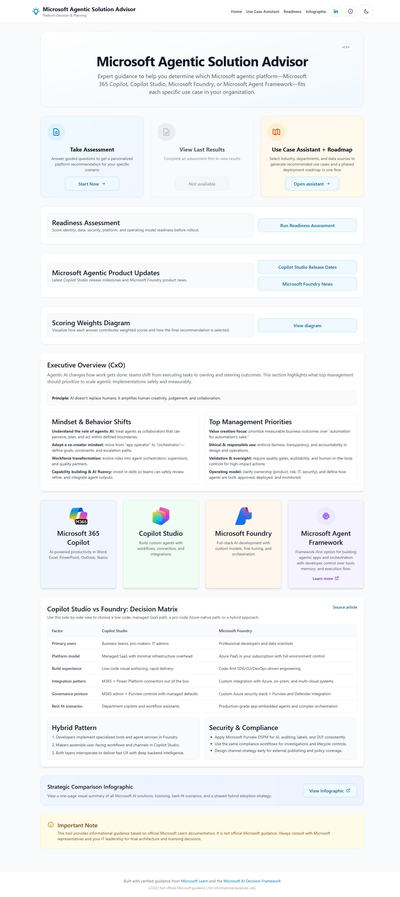
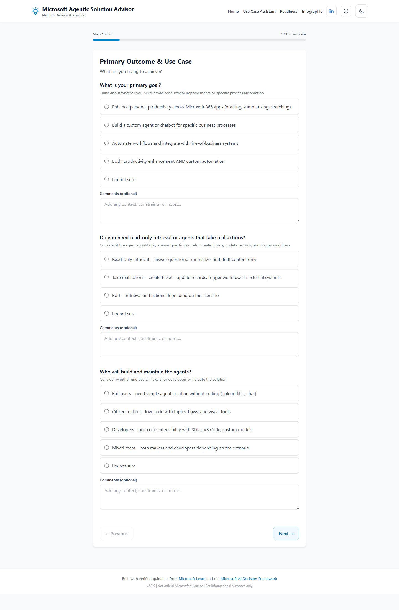
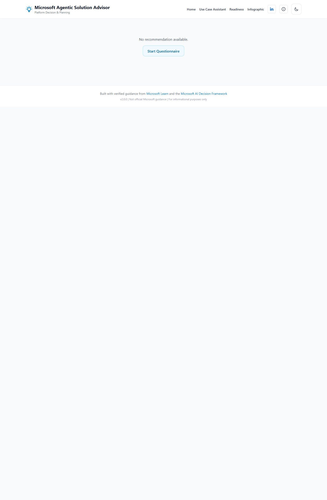
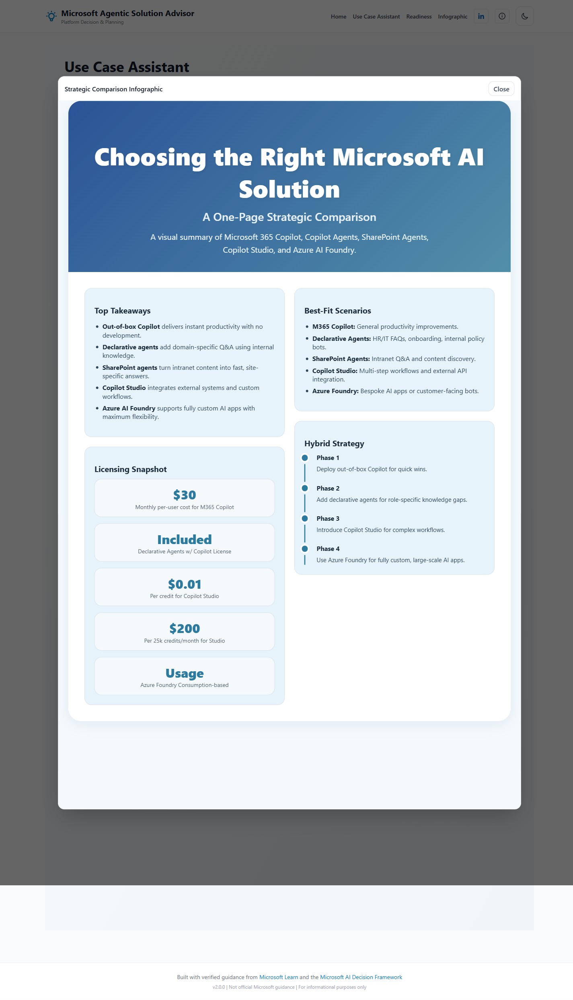
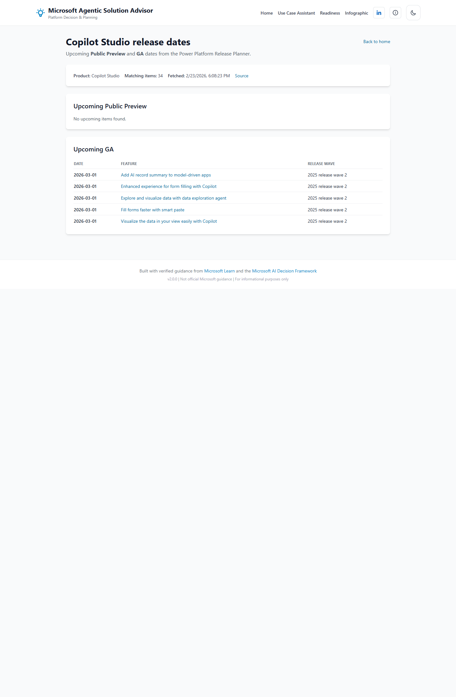
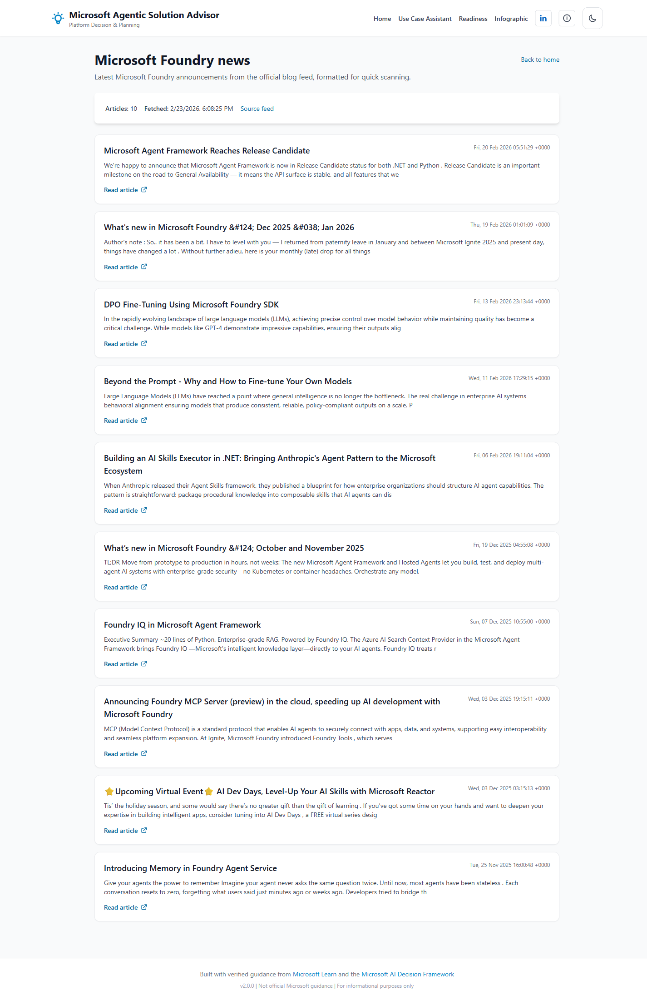
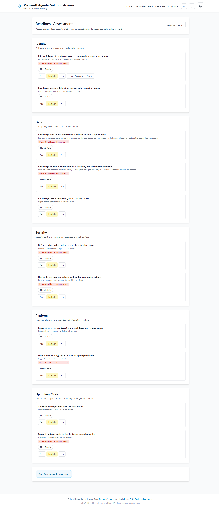
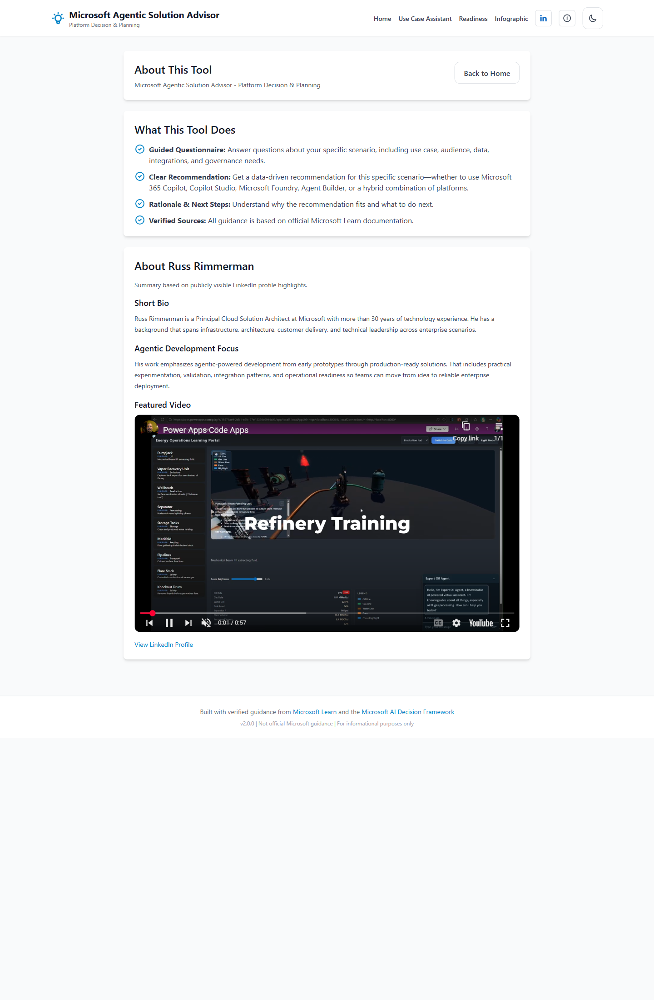
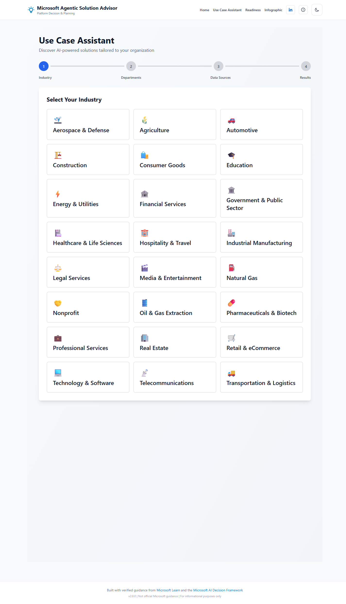

# Site Documentation (Playwright Capture)

This document provides full-page visual documentation of the current web application routes, captured with Playwright on **2026-02-23** against the local production preview build.

All listed route screenshots in this document were refreshed and rebaselined on **2026-02-23**.

## Capture Scope

- Base URL: `http://localhost:4173`
- Capture method: Playwright full-page screenshots
- Viewport: `1440x2200`
- Build target: `apps/web` production preview (`vite preview`)
- Routes captured from router config in `apps/web/src/App.tsx`
- Admin route (`/admin`) excluded because it is gated by `__ENABLE_ADMIN__`

## Route Inventory

| Route                           | Final URL                       | Screenshot                                                                            |
| ------------------------------- | ------------------------------- | ------------------------------------------------------------------------------------- |
| `/`                             | `/`                             | [home.png](site-screenshots/home.png)                                                 |
| `/wizard`                       | `/wizard`                       | [wizard.png](site-screenshots/wizard.png)                                             |
| `/results`                      | `/results`                      | [results.png](site-screenshots/results.png)                                           |
| `/use-cases`                    | `/use-cases`                    | [use-cases.png](site-screenshots/use-cases.png)                                       |
| `/copilot-studio-release-dates` | `/copilot-studio-release-dates` | [copilot-studio-release-dates.png](site-screenshots/copilot-studio-release-dates.png) |
| `/foundry-news`                 | `/foundry-news`                 | [foundry-news.png](site-screenshots/foundry-news.png)                                 |
| `/readiness`                    | `/readiness`                    | [readiness.png](site-screenshots/readiness.png)                                       |
| `/profile-summary`              | `/profile-summary`              | [profile-summary.png](site-screenshots/profile-summary.png)                           |
| `/roadmap`                      | `/use-cases` (redirect)         | [roadmap.png](site-screenshots/roadmap.png)                                           |

## Screenshots

### Home (`/`)

### Wizard (`/wizard`)

### Results (`/results`)

### Use Cases (`/use-cases`)

_Includes the Departments step to show updated department topic cards._

### Copilot Studio Release Dates (`/copilot-studio-release-dates`)

### Foundry News (`/foundry-news`)

### Readiness (`/readiness`)

### Profile Summary (`/profile-summary`)

### Roadmap Redirect Capture (`/roadmap` → `/use-cases`)

## Re-run Instructions

1. Build web app: `npm run build --workspace apps/web`
2. Start preview server from repo root: `npm --prefix apps/web run preview`
3. Re-run Playwright capture across all routes.
4. Save screenshots to `docs/site-screenshots/` and update this document.
