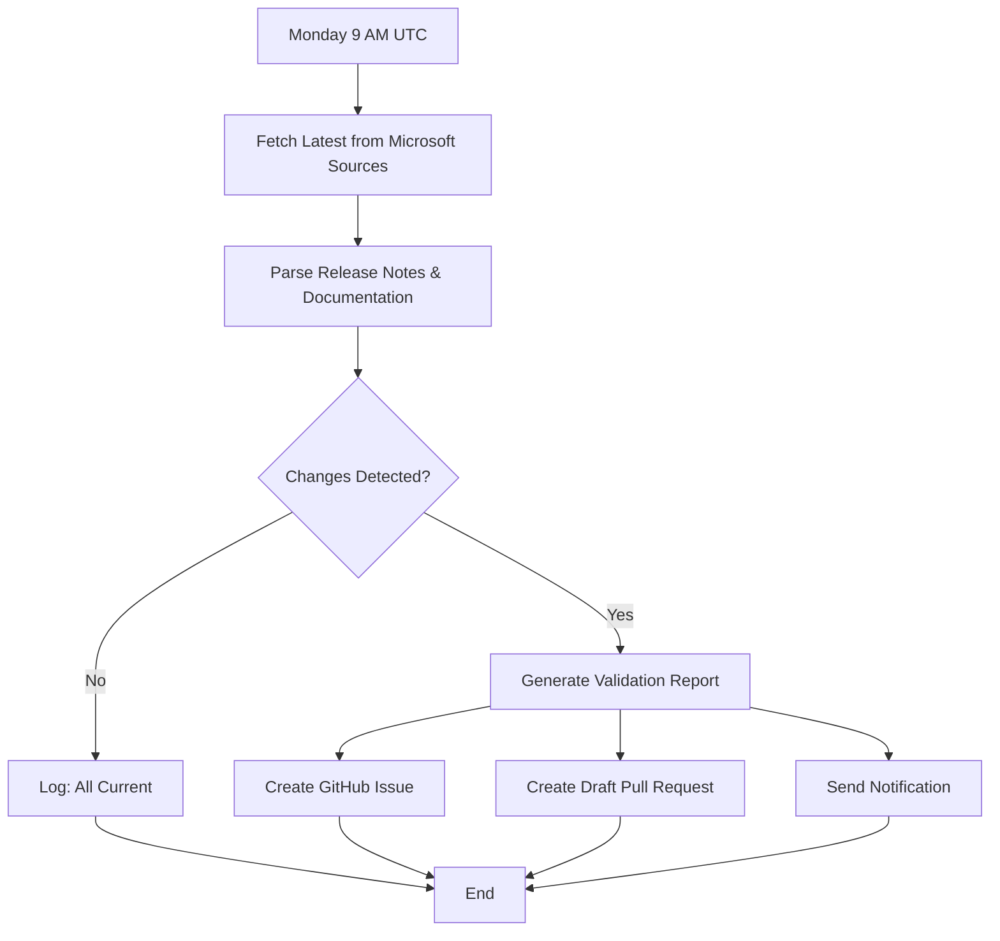

# Weekly Microsoft Product Updates Validation

This repository includes an **automated weekly validation process** that ensures the decision guidance tool, survey questions, and documentation remain accurate and aligned with the latest Microsoft product updates.

## Overview

Every **Monday at 9 AM UTC**, a GitHub Action automatically checks official Microsoft sources for updates to:

- Microsoft 365 Copilot
- Microsoft Copilot Studio
- Azure AI Foundry
- Pricing and licensing information
- Platform capabilities and features
- Mind map integrity and Microsoft 365 Copilot link policy compliance

## Sources Monitored

The validation script checks the following official Microsoft sources:

### Primary Release Notes (High Priority)

1. **[Microsoft 365 Copilot Release Notes](https://learn.microsoft.com/en-us/copilot/microsoft-365/release-notes?tabs=all)**
   - New features and capabilities
   - App integrations (Word, Excel, PowerPoint, Outlook, Teams, etc.)
   - Pricing changes
   - Deprecation warnings

2. **[Microsoft Copilot Studio What's New](https://learn.microsoft.com/en-us/microsoft-copilot-studio/whats-new)**
   - New connector capabilities
   - AI model updates
   - Pricing changes for message-based billing
   - Platform capability enhancements

3. **[Azure AI Foundry Documentation](https://learn.microsoft.com/en-us/azure/ai-studio/what-is-ai-studio)**
   - New AI services and capabilities
   - Model updates (GPT-4, embeddings, etc.)
   - RAG and vector search features
   - Service integrations

### Secondary Sources (Medium Priority)

4. **Microsoft 365 Roadmap** (Copilot filter)
   - Upcoming features
   - Release timeline updates

5. **Power Platform Release Planner**
   - Copilot Studio roadmap
   - Release schedules

6. **Microsoft Learn Documentation**
   - Documentation updates
   - Best practices changes

7. **Power Platform Pricing Pages**
   - Pricing verification
   - Licensing model changes

## What Gets Validated

### 1. Repository Accuracy

The script validates that repository data matches current Microsoft information:

- **Licensing Data** (`packages/decision-engine/src/data/licensing-data.json`)
  - Pricing per user/month
  - Copilot Credits-based pricing
  - Feature lists
  - Capability descriptions

- **Decision Model** (`packages/decision-engine/src/data/decision-model.v1.json`)
  - Survey questions reflect current capabilities
  - Answer options are accurate
  - Weights align with platform strengths
  - Metadata is current

### 2. Survey Questions Alignment

The validation specifically checks if:

- New platform capabilities require new survey questions
- Existing questions still accurately reflect product features
- Answer options need updates based on new integrations
- Helper text remains accurate

### 3. Documentation Currency

Checks if documentation needs updates:

- README feature lists
- Landing page platform descriptions
- Roadmap generator use cases
- CSAM communication templates
- Copilot instructions

### 4. Mind Map Integrity

The weekly automation validates `apps/web/src/pages/CopilotStudioMindMap.tsx` for:

- Duplicate node IDs across tree definitions
- Microsoft 365 Copilot link policy compliance (`learnUrl` values must be under `https://learn.microsoft.com/en-us/microsoft-365-copilot`)

If issues are detected, they are appended to the weekly validation report and included in generated issue/PR artifacts.

## Change Detection

The validation script detects various types of changes:

### Critical (Requires Immediate Action)

- 🚨 **Pricing Changes** - Any change to per-user or per-message pricing
- 🚨 **Major Deprecations** - Features being retired or sunset

### Major (High Priority)

- ⚠️ **New Product Releases** - Major feature announcements
- ⚠️ **Capability Changes** - Significant feature additions or modifications
- ⚠️ **AI Model Updates** - New models or model capability changes

### Minor (Standard Updates)

- 📝 **Feature Enhancements** - Incremental improvements
- 📝 **Documentation Updates** - Minor clarifications
- 📝 **New Integrations** - Additional app or service integrations

## Workflow Process

### Automatic Weekly Run



### When Changes Are Detected

1. **GitHub Issue Created**
   - Title: `📋 Microsoft Product Updates Detected - YYYY-MM-DD`
   - Labels: `documentation`, `needs-review`, `automated`, `weekly-validation`
   - Body: Detailed report of all changes

2. **Draft Pull Request Created**
   - Branch: `automated/microsoft-updates-YYYYMMDD`
   - Includes: Validation report and results JSON
   - Status: Draft (requires manual review)

3. **Notification Sent** (if configured)
   - Power Automate flow triggered OR
   - Azure Logic App triggered
   - Email sent to designated recipients

### Manual Review Steps

When you receive a validation issue:

1. **Review the Report**
   - Check the severity of detected changes
   - Note which sources reported updates
   - Identify confidence levels

2. **Verify at Source**
   - Visit the official Microsoft pages linked in the report
   - Confirm the changes are accurate
   - Read full context of any updates

3. **Update Repository Files**

   Based on changes detected:

   | Change Type  | Files to Update                            |
   | ------------ | ------------------------------------------ |
   | Pricing      | `licensing-data.json`, CSAM templates      |
   | Features     | `decision-model.v1.json`, Landing page     |
   | Capabilities | `decision-model.v1.json`, Survey questions |
   | Deprecations | All relevant documentation                 |
   | New Apps     | Landing page, Roadmap use cases            |

4. **Test the Changes**

   ```bash
   # Run the decision engine
   npm run dev

   # Complete the wizard with various scenarios
   # Verify recommendations are accurate

   # Test roadmap generator
   # Check all three platforms appear correctly
   ```

5. **Update Documentation**
   - README.md feature lists
   - QUICKSTART.md if process changed
   - Any affected markdown files

6. **Commit and Close**
   - Push updates to the draft PR
   - Mark PR as ready for review
   - Close the validation issue

7. **Validate Mind Maps**
   - Run `npm run validate:mindmaps`
   - Resolve duplicate node IDs and non-compliant Microsoft 365 Copilot links
   - Re-run validation until clean

## Manual Trigger

You can manually trigger the validation workflow:

1. Go to **Actions** tab in GitHub
2. Select **"Validate Microsoft Product Updates"**
3. Click **"Run workflow"**
4. Optionally: Check "Send notification even if no changes detected"

## Configuration

### Email Notifications (Optional)

To receive email notifications when changes are detected:

**Option 1: Power Automate**

1. Create a Power Automate flow with HTTP trigger
2. Add "Send Email" action
3. Copy the HTTP POST URL
4. Add to GitHub Secrets as `POWER_AUTOMATE_WEBHOOK_URL`

**Option 2: Azure Logic App**

1. Create an Azure Logic App with HTTP trigger
2. Add email action (Office 365, Gmail, SendGrid, etc.)
3. Copy the HTTP POST URL
4. Add to GitHub Secrets as `LOGIC_APP_WEBHOOK_URL`

### Adjusting Validation Frequency

Edit `.github/workflows/validate-microsoft-updates.yml`:

```yaml
on:
  schedule:
    # Change cron schedule as needed
    # Current: Every Monday at 9 AM UTC
    - cron: '0 9 * * 1'

    # Examples:
    # Daily at 9 AM: '0 9 * * *'
    # Bi-weekly: '0 9 1,15 * *'
    # First of month: '0 9 1 * *'
```

## Validation Results

Results are stored in two formats:

1. **Markdown Report** (`validation-report.md`)
   - Human-readable summary
   - Categorized by severity
   - Detailed by source
   - Next steps guidance

2. **JSON Results** (`validation-results.json`)
   - Machine-readable format
   - Structured change data
   - Timestamps and confidence levels
   - Programmatic access

Both files are uploaded as artifacts and retained for 90 days.

## Troubleshooting

### No Issue Created Despite Changes

Check the Actions tab for error logs. Common causes:

- Network issues fetching Microsoft pages
- GitHub API rate limits
- Missing repository permissions

### False Positives

The validation uses pattern matching and may occasionally detect changes that aren't relevant. Check the **confidence level**:

- **High** - Very likely accurate (e.g., official release notes date changes)
- **Medium** - Probably accurate (e.g., pricing pattern matches)
- **Low** - May be false positive (e.g., generic keyword matches)

Always manually verify before making changes.

### Missing Changes

The script focuses on **major, documented changes** from official sources. It may not catch:

- Undocumented features
- Preview features not in release notes
- Changes in external product (Dynamics 365, etc.)
- UI-only changes without documentation updates

## Best Practices

### For Repository Maintainers

1. **Review Weekly** - Don't let issues pile up
2. **Verify Thoroughly** - Always check the original Microsoft sources
3. **Test Before Merging** - Run the wizard with various scenarios
4. **Document Changes** - Add comments explaining why weights changed
5. **Communicate** - If major changes affect users, announce them

### For Contributors

1. **Check Open Issues** - Look for recent validation issues before making updates
2. **Reference Sources** - Link to official Microsoft documentation in PRs
3. **Update Tests** - If capabilities change, update test scenarios
4. **Maintain Consistency** - Follow existing patterns in decision model

## Technical Details

### Script Location

- Main Script: `scripts/validate-microsoft-updates.ts`
- Workflow: `.github/workflows/validate-microsoft-updates.yml`

### Adding New Sources

To add additional Microsoft sources to check:

1. Edit `scripts/validate-microsoft-updates.ts`
2. Add to the `sources` array:
   ```typescript
   {
     name: 'Source Name',
     url: 'https://learn.microsoft.com/...',
     type: 'web',
     parser: this.parseNewSource.bind(this)
   }
   ```
3. Implement the parser method:
   ```typescript
   private parseNewSource(html: string): Partial<ValidationResult> {
     const changes: Change[] = [];
     // Detection logic here
     return { changes, confidence: 'high' };
   }
   ```

### Extending Detection Logic

The script looks for:

- Date patterns (month/year combinations)
- Feature keywords ("new", "available", "launched")
- Pricing patterns ($X/user/month, $X/message)
- App names (Word, Excel, Teams, etc.)
- Deprecation keywords ("deprecated", "retiring")
- Capability terms (low-code, connectors, RAG, etc.)

Add new patterns in the parser methods as Microsoft announces new categories of features.

## Support

For issues with the validation process:

1. Check the [Actions tab](../../actions) for detailed logs
2. Review [validation-report.md](../validation-report.md) for latest run
3. Create an issue with the `validation` label
4. Include the validation results JSON if available

## Related Documentation

- [Decision Model Documentation](./decision-model.md)
- [Evaluation Criteria Alignment](./evaluation-criteria-alignment.md)
- [Quickstart Guide](./QUICKSTART.md)
- [Verified Notes](./verified-notes.md)

---

**Last Updated:** February 16, 2026  
**Validation Frequency:** Weekly (Mondays at 9 AM UTC)  
**Retention Period:** 90 days for validation artifacts
